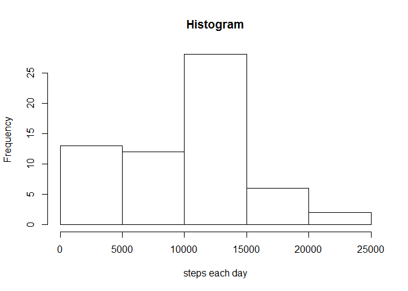
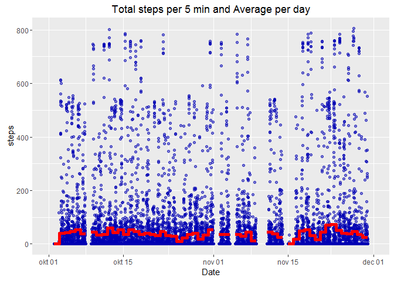
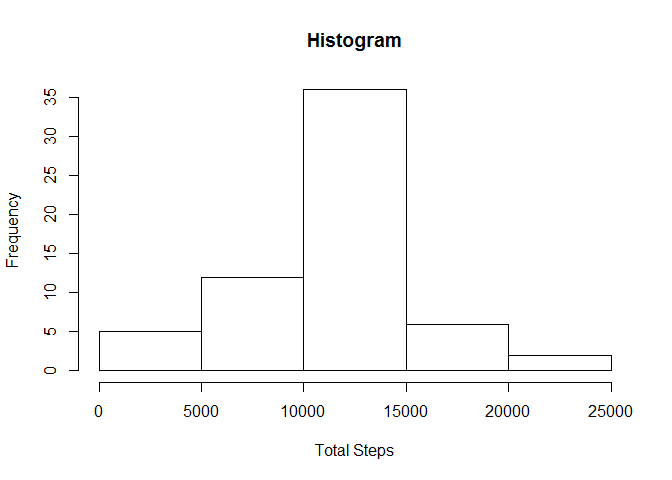
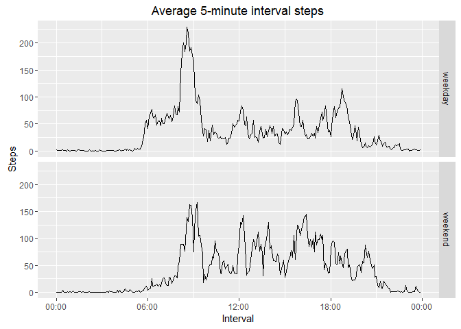

# Reproducible Research: Peer Assessment 1


## Loading and preprocessing the data


```r
dat<-read.csv(file = "activity.csv", sep = "," , header = TRUE, stringsAsFactors = FALSE)
head(dat)
```

```
##   steps       date interval
## 1    NA 2012-10-01        0
## 2    NA 2012-10-01        5
## 3    NA 2012-10-01       10
## 4    NA 2012-10-01       15
## 5    NA 2012-10-01       20
## 6    NA 2012-10-01       25
```

```r
str(dat)
```

```
## 'data.frame':	17568 obs. of  3 variables:
##  $ steps   : int  NA NA NA NA NA NA NA NA NA NA ...
##  $ date    : chr  "2012-10-01" "2012-10-01" "2012-10-01" "2012-10-01" ...
##  $ interval: int  0 5 10 15 20 25 30 35 40 45 ...
```

```r
Sys.setlocale("LC_TIME", "English")
```

```
## [1] "English_United States.1252"
```

```r
# pretty real numbers
options(scipen=9,digits=2)
```

## What is mean total number of steps taken per day?

### 1. Make a histogram of the total number of steps taken each day


```r
library(stats)
library(dplyr)
```

```
## 
## Attaching package: 'dplyr'
```

```
## The following objects are masked from 'package:stats':
## 
##     filter, lag
```

```
## The following objects are masked from 'package:base':
## 
##     intersect, setdiff, setequal, union
```

```r
library(scales)     # for ggplot x axis hh:mm formating
library(ggplot2)
library(data.table)
```

```
## 
## Attaching package: 'data.table'
```

```
## The following objects are masked from 'package:dplyr':
## 
##     between, last
```

```r
total<-dat%>%
        group_by(date)%>%
        summarize(sumTotalNumberOfSteps = sum(steps, na.rm = TRUE))
hist(total$sumTotalNumberOfSteps, xlab="steps each day", main = "Histogram")
```




### 2. Calculate and report the mean and median of the total number of steps taken per day


```r
meanTotalNumberOfStepsPerDay<-mean(total$sumTotalNumberOfSteps)
medianTotalNumberOfStepsPerDay<-median(total$sumTotalNumberOfSteps)
```
The mean of the total number of steps taken per day is:9354.23.  
The median of the total number of steps taken per day is:10395.

## What is the average daily activity pattern?

### 1. Make a time series plot (i.e. type = "l") of the 5-minute interval (x-axis) and the average number of steps taken, averaged across all days (y-axis)


```r
newInterval<-function(x){
  temp<-""
  myX <-x
  mychar <- as.character(myX)
  mycharLength<-nchar(mychar)
  myhour<-x%/%100
  mymin<-x%%100
  
  if(mycharLength == 1){
          
          myminTemp<-sprintf("%02d", mymin)
          temp<-paste("00",myminTemp, "00", sep = ':')
          
  }else if(mycharLength == 2){
         
          myminTemp<- sprintf("%02d", mymin)   
          temp<-paste("00",myminTemp, "00", sep = ':')
          
  }else if(mycharLength == 3){
         
         myhourTemp<-sprintf("%02d", myhour)
         myminTemp<-sprintf("%02d", mymin)      
         temp<-paste(myhourTemp, myminTemp, "00", sep=':')
        
  }else{
         
          #myhourTemp<-sprintf("%02d", myhour)
          #myminTemp<-sprintf("%02d", mymin) 
          mycharTemp<-substr(mychar,1,2)
          myminTemp<-substr(mychar, 3, 4)
          temp<-paste(mycharTemp, myminTemp, "00", sep=':')
  }
  return(temp)
}
#dat$date <- as.Date(dat$date)
#Thanks to Walter Medenbach for this compact code fragment. 
#This code makes newInterval function unnecessary.
dat$newInterval <- as.POSIXct(strptime(sprintf("%04d",dat$interval), "%H%M")) 
#newIntervalVector<-sapply(dat$interval, newInterval)
#dat$newInterval<-newIntervalVector
newDate <- as.POSIXct(paste(dat$date,dat$newInterval))
dat$newDate<-newDate
head(dat)
```

```
##   steps       date interval         newInterval    newDate
## 1    NA 2012-10-01        0 2016-04-04 00:00:00 2012-10-01
## 2    NA 2012-10-01        5 2016-04-04 00:05:00 2012-10-01
## 3    NA 2012-10-01       10 2016-04-04 00:10:00 2012-10-01
## 4    NA 2012-10-01       15 2016-04-04 00:15:00 2012-10-01
## 5    NA 2012-10-01       20 2016-04-04 00:20:00 2012-10-01
## 6    NA 2012-10-01       25 2016-04-04 00:25:00 2012-10-01
```

```r
str(dat)
```

```
## 'data.frame':	17568 obs. of  5 variables:
##  $ steps      : int  NA NA NA NA NA NA NA NA NA NA ...
##  $ date       : chr  "2012-10-01" "2012-10-01" "2012-10-01" "2012-10-01" ...
##  $ interval   : int  0 5 10 15 20 25 30 35 40 45 ...
##  $ newInterval: POSIXct, format: "2016-04-04 00:00:00" "2016-04-04 00:05:00" ...
##  $ newDate    : POSIXct, format: "2012-10-01" "2012-10-01" ...
```

```r
dt<-data.table(dat)
dt<-dt[, AverageStepsperInterval:=mean(steps, na.rm = TRUE),by=newInterval]

#library(ggplot2)
ggplot(dt)+ 
        geom_line(aes(x=newInterval,y=AverageStepsperInterval))+
        scale_x_datetime(labels=date_format("%H:%M",tz=Sys.timezone())) +
        ylab("Steps")+
        xlab("Interval")+
        ggtitle("Average 5-minute interval steps")
```



### 2. Which 5-minute interval, on average across all the days in the dataset, contains the maximum number of steps?


```r
whichInterval<-dt%>%
     arrange(desc(AverageStepsperInterval), desc(steps))
whichInterval[1,]
```

```
##    steps       date interval         newInterval    newDate
## 1:   786 2012-10-15      835 2016-04-04 08:35:00 2012-10-15
##    AverageStepsperInterval
## 1:                     206
```

## Imputing missing values
###Note that there are a number of days/intervals where there are missing values (coded as NA). The presence of missing days may introduce bias into some calculations or summaries of the data.

###1. Calculate and report the total number of missing values in the dataset (i.e. the total number of rows with NAs)


```r
TotalRowsWithMissingValues<-sum(is.na(dt$steps))
TotalRowsWithMissingValues
```

```
## [1] 2304
```

###2.Devise a strategy for filling in all of the missing values in the dataset. The strategy does not need to be sophisticated. For example, you could use the mean/median for that day, or the mean for that 5-minute interval, etc.

2.1 The best strategy is to use the mean of 5-minute intervals for the missing step counts. Because if a day has missing values not just for one or two intervals but all intervals for that day. This strategy is also compatible with the daily activity pattern.  

###3.Create a new dataset that is equal to the original dataset but with the missing data filled in.


```r
dt2<-dt
dt2[,whichWasNA:=is.na(steps)]
dt2[,newSteps:=ifelse(whichWasNA,AverageStepsperInterval,steps)]
TotalRowsWithMissingValuesAfterNewStrategy<-sum(is.na(dt$newSteps))
TotalRowsWithMissingValuesAfterNewStrategy
```

```
## [1] 0
```

###4.Make a histogram of the total number of steps taken each day. 


```r
totalStepsPerDay<-dt2%>%
        group_by(date)%>%
        summarize(sumTotalNumberOfStepsPerDay = sum(newSteps, na.rm = TRUE))
hist(totalStepsPerDay$sumTotalNumberOfStepsPerDay, main = "Histogram", xlab = "Total Steps")
```



###5. Calculate and report the mean and median total number of steps taken per day. Do these values differ from the estimates from the first part of the assignment? 


```r
total2<-dt2%>%
        group_by(date)%>%
        summarize(sumTotalNumberOfSteps = sum(newSteps, na.rm = TRUE))


meanTotalNumberOfStepsPerDay2<-mean(total2$sumTotalNumberOfSteps)
medianTotalNumberOfStepsPerDay2<-median(total2$sumTotalNumberOfSteps)
```
The mean of total number of steps taken per day is: 10766.19  
The median of total number of steps taken per day is :10766.19 
They differ but not so much.

####6. What is the impact of imputing missing data on the estimates of the total daily number of steps?


```r
impact<-mean(is.na(dt2$steps))
impact
```

```
## [1] 0.13
```

The total impact is about 13% percent.

## Are there differences in activity patterns between weekdays and weekends?

###1. Create a new factor variable in the dataset with two levels -- "weekday" and "weekend" indicating whether a given date is a weekday or weekend day.


```r
weekdayOrWeekend<-function(x){
        temp<-weekdays(x)
        if(temp == "Monday") return ("weekday")
        if(temp == "Tuesday") return ("weekday")
        if(temp == "Wednesday") return("weekday")
        if(temp == "Thursday") return ("weekday")
        if(temp == "Friday") return ("weekday")
        if(temp == "Saturday") return("weekend")
        if(temp == "Sunday") return("weekend")
}
weekdayOrweekend<-sapply(dt2$newDate, weekdayOrWeekend)
table(weekdayOrweekend)
```

```
## weekdayOrweekend
## weekday weekend 
##   12960    4608
```

```r
dt2$newWeekdayOrWeekend <-factor(weekdayOrweekend, levels = c("weekday", "weekend"))
```

###2. Make a panel plot containing a time series plot (i.e. type = "l") of the 5-minute interval (x-axis) and the average number of steps taken, averaged across all weekday days or weekend days (y-axis). 


```r
dt2Sub<-data.table(steps=dt2$newSteps,interval=dt2$newInterval, day=dt2$newWeekdayOrWeekend)
avgSteps<-dt2Sub%>%
                 group_by(interval,day) %>%
                 summarise(newMean=mean(steps))
ggplot(avgSteps, aes(x=interval,y=newMean))+ 
        geom_line()+
        facet_grid(day~.)+
        scale_x_datetime(labels=date_format("%H:%M",tz=Sys.timezone())) +
        ylab("Steps")+
        xlab("Interval")+
        ggtitle("Average 5-minute interval steps")
```



