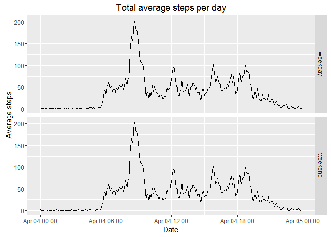

# Reproducible Research: Peer Assessment 1


## Loading and preprocessing the data


```r
dat<-read.csv(file = "activity.csv", sep = "," , header = TRUE, stringsAsFactors = FALSE)
head(dat)
```

```
##   steps       date interval
## 1    NA 2012-10-01        0
## 2    NA 2012-10-01        5
## 3    NA 2012-10-01       10
## 4    NA 2012-10-01       15
## 5    NA 2012-10-01       20
## 6    NA 2012-10-01       25
```

```r
str(dat)
```

```
## 'data.frame':	17568 obs. of  3 variables:
##  $ steps   : int  NA NA NA NA NA NA NA NA NA NA ...
##  $ date    : chr  "2012-10-01" "2012-10-01" "2012-10-01" "2012-10-01" ...
##  $ interval: int  0 5 10 15 20 25 30 35 40 45 ...
```

## What is mean total number of steps taken per day?

### 1. Calculate the total number of steps taken per day


```r
library(stats)
library(dplyr)
```

```
## 
## Attaching package: 'dplyr'
```

```
## The following objects are masked from 'package:stats':
## 
##     filter, lag
```

```
## The following objects are masked from 'package:base':
## 
##     intersect, setdiff, setequal, union
```

```r
total<-dat%>%
        group_by(date)%>%
        summarize(sTotalNumberOfSteps = sum(steps, na.rm = TRUE))
total
```

```
## Source: local data frame [61 x 2]
## 
##          date sTotalNumberOfSteps
##         (chr)               (int)
## 1  2012-10-01                   0
## 2  2012-10-02                 126
## 3  2012-10-03               11352
## 4  2012-10-04               12116
## 5  2012-10-05               13294
## 6  2012-10-06               15420
## 7  2012-10-07               11015
## 8  2012-10-08                   0
## 9  2012-10-09               12811
## 10 2012-10-10                9900
## ..        ...                 ...
```

### 2.  Make a histogram of the total number of steps taken each day


```r
#library(ggplot2)
#ggplot(total,aes(x=sTotalNumberOfSteps))+ geom_histogram(bins = 5)+xlab("Steps each day")

hist(total$sTotalNumberOfSteps, xlab="steps each day", main = "Histogram")
```


### 3. Calculate and report the mean and median of the total number of steps taken per day


```r
totalMeanAndMedian<-dat%>%
        group_by(date)%>%
        summarize(mean = mean(x=steps, na.rm=TRUE), median = median(x=steps, na.rm=TRUE))
totalMeanAndMedian
```

```
## Source: local data frame [61 x 3]
## 
##          date     mean median
##         (chr)    (dbl)  (dbl)
## 1  2012-10-01      NaN     NA
## 2  2012-10-02  0.43750      0
## 3  2012-10-03 39.41667      0
## 4  2012-10-04 42.06944      0
## 5  2012-10-05 46.15972      0
## 6  2012-10-06 53.54167      0
## 7  2012-10-07 38.24653      0
## 8  2012-10-08      NaN     NA
## 9  2012-10-09 44.48264      0
## 10 2012-10-10 34.37500      0
## ..        ...      ...    ...
```

## What is the average daily activity pattern?

### 1. Make a time series plot (i.e. type = "l") of the 5-minute interval (x-axis) and the average number of steps taken, averaged across all days (y-axis)

```r
newInterval<-function(x){
  temp<-""
  myX <-x
  mychar <- as.character(myX)
  mycharLength<-nchar(mychar)
  myhour<-x%/%100
  mymin<-x%%100
  
  if(mycharLength == 1){
          
          myminTemp<-sprintf("%02d", mymin)
          temp<-paste("00",myminTemp, "00", sep = ':')
          
  }else if(mycharLength == 2){
         
          myminTemp<- sprintf("%02d", mymin)   
          temp<-paste("00",myminTemp, "00", sep = ':')
          
  }else if(mycharLength == 3){
         
         myhourTemp<-sprintf("%02d", myhour)
         myminTemp<-sprintf("%02d", mymin)      
         temp<-paste(myhourTemp, myminTemp, "00", sep=':')
        
  }else{
         
          #myhourTemp<-sprintf("%02d", myhour)
          #myminTemp<-sprintf("%02d", mymin) 
          mycharTemp<-substr(mychar,1,2)
          myminTemp<-substr(mychar, 3, 4)
          temp<-paste(mycharTemp, myminTemp, "00", sep=':')
  }
  return(temp)
}

newIntervalVector<-sapply(dat$interval, newInterval)
dat$newInterval<-newIntervalVector
newDate <- as.POSIXct(paste(dat$date,dat$newInterval))
dat$newDate<-newDate
head(dat)
```

```
##   steps       date interval newInterval             newDate
## 1    NA 2012-10-01        0    00:00:00 2012-10-01 00:00:00
## 2    NA 2012-10-01        5    00:05:00 2012-10-01 00:05:00
## 3    NA 2012-10-01       10    00:10:00 2012-10-01 00:10:00
## 4    NA 2012-10-01       15    00:15:00 2012-10-01 00:15:00
## 5    NA 2012-10-01       20    00:20:00 2012-10-01 00:20:00
## 6    NA 2012-10-01       25    00:25:00 2012-10-01 00:25:00
```

```r
str(dat)
```

```
## 'data.frame':	17568 obs. of  5 variables:
##  $ steps      : int  NA NA NA NA NA NA NA NA NA NA ...
##  $ date       : chr  "2012-10-01" "2012-10-01" "2012-10-01" "2012-10-01" ...
##  $ interval   : int  0 5 10 15 20 25 30 35 40 45 ...
##  $ newInterval: chr  "00:00:00" "00:05:00" "00:10:00" "00:15:00" ...
##  $ newDate    : POSIXct, format: "2012-10-01 00:00:00" "2012-10-01 00:05:00" ...
```

```r
library(data.table)
```

```
## 
## Attaching package: 'data.table'
```

```
## The following objects are masked from 'package:dplyr':
## 
##     between, last
```

```r
dt<-data.table(dat)
dt<-dt[, AverageStepsperDay:=mean(steps, na.rm = TRUE),by=date]
#table(dt$AverageStepsperDay)
#plot(dt$newDate,dat$steps, col=rgb(0,0,0.7,alpha = .5))
#lines(x=dt$newDate, y=dt$AverageStepsperDay, type = "l", col="red", lwd=3)
library(ggplot2)
ggplot(dt)+ geom_point(aes(x=newDate, y=steps), col=rgb(0,0,0.7,alpha = .5))+
        geom_line(aes(x=newDate,y=AverageStepsperDay), col="red", size=2)+
        xlab("Date")+
        ggtitle("Total steps per 5 min and Average per day")
```

```
## Warning: Removed 2304 rows containing missing values (geom_point).
```

```
## Warning: Removed 576 rows containing missing values (geom_path).
```


### 2. Which 5-minute interval, on average across all the days in the dataset, contains the maximum number of steps?


```r
head(dt)
```

```
##    steps       date interval newInterval             newDate
## 1:    NA 2012-10-01        0    00:00:00 2012-10-01 00:00:00
## 2:    NA 2012-10-01        5    00:05:00 2012-10-01 00:05:00
## 3:    NA 2012-10-01       10    00:10:00 2012-10-01 00:10:00
## 4:    NA 2012-10-01       15    00:15:00 2012-10-01 00:15:00
## 5:    NA 2012-10-01       20    00:20:00 2012-10-01 00:20:00
## 6:    NA 2012-10-01       25    00:25:00 2012-10-01 00:25:00
##    AverageStepsperDay
## 1:                NaN
## 2:                NaN
## 3:                NaN
## 4:                NaN
## 5:                NaN
## 6:                NaN
```

```r
whichInterval<-dt%>%
     arrange(desc(AverageStepsperDay), desc(steps))
whichInterval[1,]
```

```
##    steps       date interval newInterval             newDate
## 1:   760 2012-11-23     1520    15:20:00 2012-11-23 15:20:00
##    AverageStepsperDay
## 1:           73.59028
```

## Imputing missing values
###Note that there are a number of days/intervals where there are missing values (coded as NA). The presence of missing days may introduce bias into some calculations or summaries of the data.

###1. Calculate and report the total number of missing values in the dataset (i.e. the total number of rows with NAs)

```r
TotalRowsWithMissingValues<-sum(is.na(dt$steps))
TotalRowsWithMissingValues
```

```
## [1] 2304
```

###2.Devise a strategy for filling in all of the missing values in the dataset. The strategy does not need to be sophisticated. For example, you could use the mean/median for that day, or the mean for that 5-minute interval, etc.
2.1 I will use the avreage of steps of that day for the missing values as strategy.

###3.Create a new dataset that is equal to the original dataset but with the missing data filled in.

```r
dt2<-dt
dt2[,whichWasNA:=is.na(steps)]
dt2[,newSteps:=ifelse(whichWasNA,AverageStepsperDay,steps)]
TotalRowsWithMissingValuesAfterNewStrategy<-sum(is.na(dt$newSteps))
TotalRowsWithMissingValuesAfterNewStrategy
```

```
## [1] 2304
```

```r
#We have same value above. There are days with any values thus I will change my strategy. 
#I will use the average of steps of All days for the missing values this time.
allDaysAvg<-mean(dt2$steps, na.rm = TRUE)
dt2[,newSecondSteps:=ifelse(whichWasNA,allDaysAvg, steps)]
TotalRowsWithMissingValuesAfterSecondStrategy<-sum(is.na(dt$newSecondSteps))
TotalRowsWithMissingValuesAfterSecondStrategy
```

```
## [1] 0
```

###3.Make a histogram of the total number of steps taken each day and Calculate and report the mean and median total number of steps taken per day. Do these values differ from the estimates from the first part of the assignment? What is the impact of imputing missing data on the estimates of the total daily number of steps?


```r
totalStepsPerDay<-dt2%>%
        group_by(dt2$date)%>%
        summarize(sTotalNumberOfStepsPerDay = sum(newSecondSteps, na.rm = TRUE))
hist(totalStepsPerDay$sTotalNumberOfStepsPerDay, main = "Histogram", xlab = "Total Steps")
```


```r
MeanAndMedianAfterStrategy<-dt2%>%
        group_by(date)%>%
        summarize(mean = mean(x=newSecondSteps, na.rm=TRUE), median = median(x=newSecondSteps, na.rm=TRUE))
head(MeanAndMedianAfterStrategy)
```

```
##         date     mean  median
## 1 2012-10-01 37.38260 37.3826
## 2 2012-10-02  0.43750  0.0000
## 3 2012-10-03 39.41667  0.0000
## 4 2012-10-04 42.06944  0.0000
## 5 2012-10-05 46.15972  0.0000
## 6 2012-10-06 53.54167  0.0000
```

####3.1  Do these values differ from the estimates from the first part of the assignment?
They differ but not so much.


```r
impact<-mean(is.na(dt2$steps))
impact
```

```
## [1] 0.1311475
```

The total impact is about 13% percent.

## Are there differences in activity patterns between weekdays and weekends?

###1. Create a new factor variable in the dataset with two levels -- "weekday" and "weekend" indicating whether a given date is a weekday or weekend day.


```r
Sys.setlocale("LC_TIME", "English")
```

```
## [1] "English_United States.1252"
```

```r
weekdayOrWeekend<-function(x){
        temp<-weekdays(x)
        if(temp == "Monday") return ("weekday")
        if(temp == "Tuesday") return ("weekday")
        if(temp == "Wednesday") return("weekday")
        if(temp == "Thursday") return ("weekday")
        if(temp == "Friday") return ("weekday")
        if(temp == "Saturday") return("weekend")
        if(temp == "Sunday") return("weekend")
}
weekdayOrweekend<-sapply(dt2$newDate, weekdayOrWeekend)
table(weekdayOrweekend)
```

```
## weekdayOrweekend
## weekday weekend 
##   12960    4608
```

```r
dt2$newWeekdayOrWeekend <-factor(weekdayOrweekend, levels = c("weekday", "weekend"))
head(weekdayOrweekend)
```

```
## [1] "weekday" "weekday" "weekday" "weekday" "weekday" "weekday"
```

###2. Make a panel plot containing a time series plot (i.e. type = "l") of the 5-minute interval (x-axis) and the average number of steps taken, averaged across all weekday days or weekend days (y-axis). The plot should look something like the following, which was created using simulated data:

```r
dt2<-dt2[, newSecondAverageStepsperDay:=mean(newSecondSteps, na.rm = TRUE),by=date]
qplot(x=newDate, y=newSecondAverageStepsperDay, data = dt2, geom=c("line"), facets = newWeekdayOrWeekend~.)+ylab("Average steps")+xlab("Date")+ggtitle("Total average steps per day")
```



