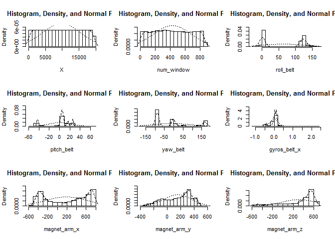

# Machine-Peer-Project
Z. Ozcan  
26 June 2016  
###Synposis
Our goal will be to use data from accelerometers on the belt, forearm, arm, and dumbell of 6 participants to predict the manner in which they did the exercise.

###Data Load and Transformation
First, we load our data and libraries that are nessesary.


```r
library(caret)
library(dplyr, quietly=TRUE,verbose=FALSE,warn.conflicts = FALSE)
dat<-read.csv("pml-training.csv", header = TRUE, na.strings = c(""))
dattest<-read.csv("pml-testing.csv", header=TRUE, na.strings = c(""))
```

We also removed some calculated variables to make easy for us.


Here, we give some variables from training data to explore:

<!-- -->

###Model Selection
We used a model for the classification. To see that we are on the right direction we selected data form one participant from the training data and we divided this data in the training and test data. 


```
##        
## pJeremy   A   B   C   D   E
##       A 357   0   0   0   0
##       B   0 159   0   0   0
##       C   0   0 183   0   0
##       D   0   0   0 167   0
##       E   0   0   0   0 165
```

```
## Confusion Matrix and Statistics
## 
##           Reference
## Prediction   A   B   C   D   E
##          A 357   0   0   0   0
##          B   0 159   0   0   0
##          C   0   0 183   0   0
##          D   0   0   0 167   0
##          E   0   0   0   0 165
## 
## Overall Statistics
##                                      
##                Accuracy : 1          
##                  95% CI : (0.9964, 1)
##     No Information Rate : 0.3463     
##     P-Value [Acc > NIR] : < 2.2e-16  
##                                      
##                   Kappa : 1          
##  Mcnemar's Test P-Value : NA         
## 
## Statistics by Class:
## 
##                      Class: A Class: B Class: C Class: D Class: E
## Sensitivity            1.0000   1.0000   1.0000    1.000     1.00
## Specificity            1.0000   1.0000   1.0000    1.000     1.00
## Pos Pred Value         1.0000   1.0000   1.0000    1.000     1.00
## Neg Pred Value         1.0000   1.0000   1.0000    1.000     1.00
## Prevalence             0.3463   0.1542   0.1775    0.162     0.16
## Detection Rate         0.3463   0.1542   0.1775    0.162     0.16
## Detection Prevalence   0.3463   0.1542   0.1775    0.162     0.16
## Balanced Accuracy      1.0000   1.0000   1.0000    1.000     1.00
```

The prediction table and the confusionMatrix above look good. We have 100% accuracy! To see our selected classification model does good job we used all our original training data and divided in de training and testing data for all participants. 


```
##     
## pAll    A    B    C    D    E
##    A 1625    0    0    0    0
##    B    0 1197    0    0    0
##    C    0    0 1004    0    0
##    D    0    0    0  994    0
##    E    0    0    0    0 1065
```

```
## Confusion Matrix and Statistics
## 
##           Reference
## Prediction    A    B    C    D    E
##          A 1625    0    0    0    0
##          B    0 1197    0    0    0
##          C    0    0 1004    0    0
##          D    0    0    0  994    0
##          E    0    0    0    0 1065
## 
## Overall Statistics
##                                      
##                Accuracy : 1          
##                  95% CI : (0.9994, 1)
##     No Information Rate : 0.2761     
##     P-Value [Acc > NIR] : < 2.2e-16  
##                                      
##                   Kappa : 1          
##  Mcnemar's Test P-Value : NA         
## 
## Statistics by Class:
## 
##                      Class: A Class: B Class: C Class: D Class: E
## Sensitivity            1.0000   1.0000   1.0000   1.0000    1.000
## Specificity            1.0000   1.0000   1.0000   1.0000    1.000
## Pos Pred Value         1.0000   1.0000   1.0000   1.0000    1.000
## Neg Pred Value         1.0000   1.0000   1.0000   1.0000    1.000
## Prevalence             0.2761   0.2034   0.1706   0.1689    0.181
## Detection Rate         0.2761   0.2034   0.1706   0.1689    0.181
## Detection Prevalence   0.2761   0.2034   0.1706   0.1689    0.181
## Balanced Accuracy      1.0000   1.0000   1.0000   1.0000    1.000
```

###Final Prediction
Our selected model did good job and we are ready for our original test data! But, you must not see the predictions for security reasons. 


